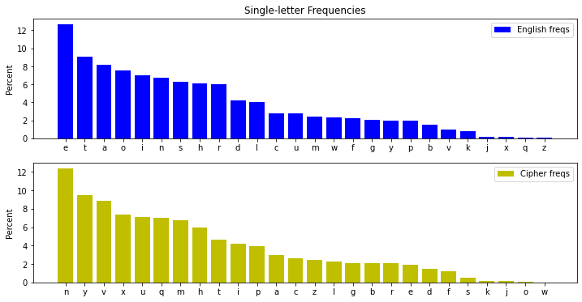
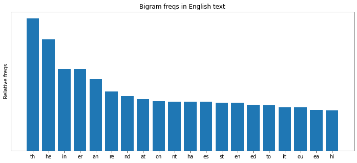
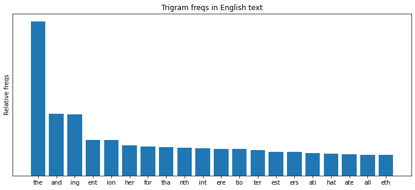

# ECE 571: Lab 1

> Date: 2022-02-16

## Task 1: Frequency Analysis Against Monoalphabetic Substitution Cipher

By comparing the letters letter counting information of file `ciphertext.txt` is then compared with known information of English letters, i.e., frequencies of single letters, bigrams and trigrams, the following figures demonstrating ordered frequencies are easily acquired.

1. Single-letter frequency analysis



2. Bigram frequency in the English language




3. Trigram frequency analysis




Then by analyzing step-by-step the cipher and plaintext with "Crack Substitution Tool", the series of substitution rules are obtained eventually.


Thus the encryption key string is `vgapnbrtmosicuxejhqyzflkdw`. By running `tr` command in Linux CLI, 

```shell
tr 'vgapnbrtmosicuxejhqyzflkdw' 'abcdefghijklmnopqrstuvwxyz' <ciphertext.txt> decrypted.txt
```

the plaintext content `decrypted.txt` is acquired, which is attached in the current folder.

##  Task 2: Encryption using Different Ciphers and Modes

```shell
$ openssl enc -aes-128-cbc -e -in plain.txt -out cipher1.bin -K 00112233445566778889aabbccddeeff -iv 0102030405060708

$ openssl enc -cast-cbc -e -in plain.txt -out cipher2.bin -K 00112233445566778889aabbccddeeff -iv 0102030405060708

$ openssl enc -id-aes128-GCM  -e -in plain.txt -out cipher3.bin -K 00112233445566778889aabbccddeeff -iv 0102030405060708

```

Herein I used three different ciphertypes (i.e., aes-128-abc, cast-cbc,id-aes128-GCM) to encrypt file `plain.txt`, then corresponding cipher files (`cipher1.bin`, `cipher2.bin`, `cipher3.bin`) are acquired and attached the submission folder.

## Task 3: Encryption Mode – ECB vs. CBC

Corresponding commands are in the attached `pic_encrypt.sh` script. While the following results demonstrate that different encryption modes could hide different-extent origin information.  Because ECE algorithm encrypts each block independently, the "cipher" picture will correspondingly shows original useful information to some extent.

- CBC cipher type

  Cannot acquire and useful information of the original picture from this "cipher" picture.


- ECB cipher type

  Obviously the "cipher" picture has rough discrimination in color and contour. So there is much useful information from this "cipher" picture.


##  Task 4: Padding

1. Encryption modes & padding

   ```shell
   $ openssl enc -aes-128-ofb -e -in plain.txt -out enc_ofb.bin -K 00112233445566778889aabbccddeeff -iv 0102030405060708
   # hex string is too short, padding with zero bytes to length
   $ openssl enc -aes-128-cbc -e -in plain.txt -out enc_cbc.bin -K 00112233445566778889aabbccddeeff -iv 0102030405060708
   # hex string is too short, padding with zero bytes to length
   $ openssl enc -aes-128-ecb -e -in plain.txt -out enc_ecb.bin -K 00112233445566778889aabbccddeeff -iv 0102030405060708
   # warning: iv not used by this cipher
   $ openssl enc -aes-128-cfb -e -in plain.txt -out enc_cfb.bin -K 00112233445566778889aabbccddeeff -iv 0102030405060708
   # hex string is too short, padding with zero bytes to length
   
   ```

   - ECB: no padding (the Electronic Codebook Mode does not need padding herein)
   - CBC: padding
   - CFB: padding
   - OFB: padding

3. Observe encryption padding

   Firstly three text files contains 5, 10, 16 bytes are created subsequently:

   ```shell
   $ echo -n "01234" > f1.txt
   $ echo -n "0123456789" > f2.txt
   $ echo -n "0123456789abcdef" > f3.txt
   ```

   Encrypt three files by "aes-128-cbc" cipher type with key "123456"。

   ```shell
   $ openssl enc -aes-128-cbc -e -in f1.txt -out f1_enc.txt -K 123456 -iv 123456
   $ openssl enc -aes-128-cbc -e -in f2.txt -out f2_enc.txt -K 123456 -iv 123456
   $ openssl enc -aes-128-cbc -e -in f3.txt -out f3_enc.txt -K 123456 -iv 123456
   wc f1_enc.txt f2_enc.txt f3_enc.txt
   #  0   1  32 f1_enc.txt
   #  0   1  32 f2_enc.txt
   #  0   1  48 f3_enc.txt
   ```

   Thus the sizes of three encrypted files (in byte) are 32, 32, 48, respectively. By comparing the decrypted content (without removing padding) and the content of plain text as follows, it can be concluded that the padding character is `.`.
   
   ```shell
   $ xxd f1.txt
   # 00000000: 3031 3233 34                             01234
   $ xxd f2.txt
   # 00000000: 3031 3233 3435 3637 3839                 0123456789
   $ xxd f3.txt
   # 00000000: 3031 3233 3435 3637 3839 6162 6364 6566  0123456789abcdef
   
   $ openssl enc -aes-128-cbc -d -in f1_enc.txt -K 123456 -iv 123456 -nopad | xxd
   # 00000000: 3031 3233 340b 0b0b 0b0b 0b0b 0b0b 0b0b  01234...........
   $ openssl enc -aes-128-cbc -d -in f2_enc.txt -K 123456 -iv 123456 -nopad | xxd
   # 00000000: 3031 3233 3435 3637 3839 0606 0606 0606  0123456789......
   $ openssl enc -aes-128-cbc -d -in f3_enc.txt -K 123456 -iv 123456 -nopad | xxd
   # 00000000: 3031 3233 3435 3637 3839 6162 6364 6566  0123456789abcdef
   # 00000010: 1010 1010 1010 1010 1010 1010 1010 1010  ................
   ```
   

## Task 5: Error Propagation – Corrupted Cipher Text

"aes-128-*" uses 128-bit en/decryption algorithms. 128 bits is 16 bytes. So, if there is one-byte cipher data is corrupted, after decryption with correct keys, **16-byte (128-bit)** data will not be recovered. For "aes-128-cbc", "aes-128-ecb", "aes-128-cfb" and "aes-128-ofb" the result will be the same.

Following is experiments for verification:

The following encryption script and  decryption script are used in my test. 

```shell
# 1) construct a file with 1000+ bytes (herein we use the plain.txt file)

# 2) encryption commands
openssl enc -aes-128-cbc -e -in plain.txt -out cipher_cbc.bin -K 123456 -iv 123456
openssl enc -aes-128-ecb -e -in plain.txt -out cipher_ecb.bin -K 123456 -iv 123456
openssl enc -aes-128-cfb -e -in plain.txt -out cipher_cfb.bin -K 123456 -iv 123456
openssl enc -aes-128-ofb -e -in plain.txt -out cipher_ofb.bin -K 123456 -iv 123456


# 3) ...... modifying the 55th byte content of ciphers using visulization editor


# 4) decryption commands
openssl enc -aes-128-cbc -d -in cipher_cbc.bin -out dec_cbc.txt -K 123456 -iv 123456
openssl enc -aes-128-ecb -d -in cipher_ecb.bin -out dec_ecb.txt -K 123456 -iv 123456
openssl enc -aes-128-cfb -d -in cipher_cfb.bin -out dec_cfb.txt -K 123456 -iv 123456
openssl enc -aes-128-ofb -d -in cipher_ofb.bin -out dec_ofb.txt -K 123456 -iv 123456
```

Herein I used "wxMEdit" software to modify the 55th byte content of ciphers. For instance, for the file "cipher_cbc.bin", "7D" was replaced by "6C".


After decryption, the hex-mode content of plain text and decrypted text have obvious difference in the **4th row** output, i.e., 16-byte content. And verification results for "OFB", "ECB" and "CFB" algorithms are also like this.

```shell
$ xxd dec_cbc.txt | head -6
# 00000000: 7468 6520 6f73 6361 7273 2074 7572 6e20  the oscars turn
# 00000010: 206f 6e20 7375 6e64 6179 2077 6869 6368   on sunday which
# 00000020: 2073 6565 6d73 2061 626f 7574 2072 6967   seems about rig
# 00000030: ac1a d89f b67a 8816 f664 ae0b 3495 422e  .....z...d..4.B.
# 00000040: 6e67 2073 7472 706e 6765 0a61 7761 7264  ng strpnge.award
# 00000050: 7320 7472 6970 2074 6865 2062 6167 6765  s trip the bagge

$ xxd plain.txt | head -6
# 00000000: 7468 6520 6f73 6361 7273 2074 7572 6e20  the oscars turn
# 00000010: 206f 6e20 7375 6e64 6179 2077 6869 6368   on sunday which
# 00000020: 2073 6565 6d73 2061 626f 7574 2072 6967   seems about rig
# 00000030: 6874 2061 6674 6572 2074 6869 7320 6c6f  ht after this lo
# 00000040: 6e67 2073 7472 616e 6765 0a61 7761 7264  ng strange.award
# 00000050: 7320 7472 6970 2074 6865 2062 6167 6765  s trip the bagge
```

## Task 6: Initial Vector (IV)

1. Uniqueness of IV

   ```shell
   $ openssl enc -aes-128-cbc -e -in plain.txt -out cipher_iv_1-1.bin -K 00112233445566778889aabbccddeeff -iv 123456
   $ openssl enc -aes-128-cbc -e -in plain.txt -out cipher_iv_1-2.bin -K 00112233445566778889aabbccddeeff -iv 123456
   $ openssl enc -aes-128-cbc -e -in plain.txt -out cipher_iv_2.bin -K 00112233445566778889aabbccddeeff -iv 654321
   ```

   The observed results are as follows. Because files `cipher_iv_1-1.bin` and `cipher_iv_1-2.bin` are generated with the same IV, their encrypted cipher text are the same. Correspondingly, cipher content of `cipher_iv_2.bin` is different with them. Thus using the same IV to encrypt is vulnerable to attack.

   

   

   

2. Same IV

   Apparently this belongs to 192-OFB cipher type. Suppose the cipher string C1 is obtained via XOR between the plaintext string P1 `This is a known message!` and an encoded IV, then the encoded IV could be acquired by XOR operation, that is `f001d8b622a8b99907b6353e2d2356c1d67e2ce356c3a478`. Therefore, by operating XOR between this encoded IV and cipher string C2, the plaintext P2  = `4f726465723a204c61756e63682061206d697373696c6521`, i.e., `Order: Launch a missile!` in ASCII.

   If the cipher type is replaced by "CFB" mode, the first block of plaintext could be attached. For case of this problem, the plaintext P2 just consists of "one" block (192 bits), thus the entire plaintext string `Order: Launch a missile!` could also be decrypted.

3. Unpredictability of IV

   Note $R_1=IV\oplus P_1$ and $R_2=(IV+1)\oplus P_2$

   If $R_1=R_2$, the encrypted ciphers should be the same, i.e., $C_1=C_2$

   Thus, 
   $$
   P_2=(IV+1)\oplus R_2=(IV+1)\oplus (IV\oplus P_1)
   $$
   When $P_1$ is "Yes", the calculated $P_2$ is `59657320202020202020202020202021`, i.e., "Yes            !".

   Let Eve use this "Yes            !" as input plaintext $P_2$, if the output cipher $C_2$ is the same as $C_1$, then $P_1$ is "Yes"; otherwise, it is "No".

## References & Tools

- [CryptoClub](https://www.cryptoclub.org/)
- [Practical Cryptography](http://practicalcryptography.com/cryptanalysis/text-characterisation/monogram-bigram-and-trigram-frequency-counts/)

